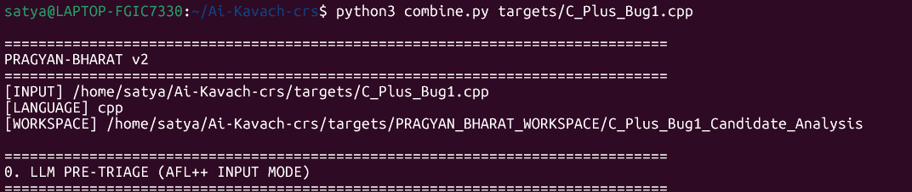

# PRAGYAN-BHARAT 🇮🇳

### Autonomous Cyber Reasoning & Vulnerability Triage System

> **AI Kavach — Autonomous Cyber Reasoning System** (Demo) 



> [!NOTE]
> **Repository Status:** Due to an ongoing evaluation and selection phase, core production code has been temporarily restricted. 
> * **Live Demos:** You can review working demonstrations and output artifacts inside the `targets/` folder.
> * **Fully Available Module:** **Stage Zero** (our Password and Sensitive Information Analyzer) is fully open and available to view in this repository- (password.py file).


PRAGYAN-BHARAT is an offline-first, evidence-driven cyber reasoning system designed to investigate software vulnerabilities in security-critical and defence-relevant environments.

Instead of relying on a single scanner or a single LLM decision, PRAGYAN-BHARAT combines **program structure, code property graphs, static analysis, dynamic execution evidence, sanitizers, fuzzing, and local LLM reasoning** to determine whether a suspected vulnerability is actually reachable, exploitable, and worth fixing.

The system is designed around a simple principle:

> **A suspicious line is not automatically a vulnerability. A vulnerability decision should be supported by evidence.**

---

Basic structure for Fuzzing and CodeQL- Heart of Pragyan-

 AI-Powered Software Security Reasoning Engine

Discover 🔎 → Reproduce 💥 → Correlate 🔗 → Reason 🧠 → Verify 🔬 → Repair 🛠️ → Assure 🛡️

# PRAGYAN BHARAT WORKSPACE - Candidate Analysis Framework

## 🚀 Core Technical Capabilities

1. 🧠 **Evidence-Driven Security Reasoning:** Converts heterogeneous static, dynamic, and runtime observations into a unified vulnerability hypothesis.

2. 🎯 **Adaptive Analysis Orchestration:** Selects the most relevant analysis path from source characteristics, language, execution model, and input surface instead of blindly executing every tool.

3. 🔗 **Cross-Domain Evidence Correlation:** Correlates CodeQL findings, fuzzing behavior, sanitizer diagnostics, execution paths, and source-level context before assigning confidence.

4. 💥 **Crash-to-Root-Cause Reasoning:** Transforms a raw fuzzing crash into a reproducible execution condition, fault location, root cause, and security impact.

5. 🧬 **Runtime-Backed Static Verification:** Uses concrete runtime evidence to validate whether statically identified data flows are actually reachable and security-relevant.

6. 🧠 **Context-Compressed LLM Reasoning:** Reduces massive tool output into high-signal security evidence before inference, minimizing token waste while preserving causal context.

7. ⚔️ **Adversarial Candidate Verification:** Every vulnerability hypothesis is challenged with contradictory evidence and independent reproduction before acceptance.

8. 🔄 **Closed-Loop Vulnerability Reasoning:**  
   **Discovery → Reproduction → Correlation → Hypothesis → Verification → Repair → Regression Validation**

9. 🛡️ **Repair-Aware Security Analysis:** Treats generated patches as untrusted candidates and subjects them to rebuild, runtime validation, sanitizer checks, and regression analysis.

10. 🚫 **No Finding = No Automatic Trust:** Absence of evidence from one analyzer never becomes evidence of safety.

11. 📊 **Evidence-Weighted Confidence:** Confidence increases through independent corroboration and decreases when execution, static analysis, or reproduction contradicts the hypothesis.

12. 🧩 **Tool-Agnostic Security Orchestration:** Analysis components are treated as evidence producers rather than authoritative decision makers.

13. ⚡ **Signal-First Intelligence:** Prioritizes security-relevant execution paths, sinks, inputs, crashes, and sanitizer traces instead of forwarding raw logs to the LLM.

14. 🔬 **Reproducibility-Centric Detection:** A candidate finding is strengthened by deterministic reproduction and weakened by failed reproduction.

15. 🧠 **Reasoning Under Incomplete Evidence:** Distinguishes **Confirmed**, **Probable**, **Plausible**, **Inconclusive**, and **Unverified** conditions instead of forcing binary decisions.


**Repository Architecture**

* **`AFL++/`**  
  Fuzzing campaign artifacts.
  * `seeds/`: Initial test case corpus.
  * `findings/`: Execution queue and status logs.
  * `crashes/`: Isolated inputs causing program faults.
  * `AFL_compact.txt`: Condensed fuzzing execution metrics.

* **`CodeQL/`**  
  Static semantic analysis outputs.
  * `database/`: Queryable database snapshot.
  * `results/`: Detailed vulnerability reports.
  * `CodeQL_compact.txt`: Executive summary of static defects.

* **`ASAN/`**  
  AddressSanitizer memory error logs.
  * `logs/`: Runtime stack traces for memory violations.
  * `ASAN_compact.txt`: Condensed memory error breakdown.

* **`UBSAN/`**  
  UndefinedBehaviorSanitizer diagnostics.
  * `logs/`: Runtime logs for compiler-detected undefined behavior.
  * `UBSAN_compact.txt`: Summary of undefined behavior instances.

* **`LLM/`**  
  AI-driven analysis and workflow management.
  * `execution_plan.txt`: Automated triage roadmap.
  * `initial_analysis.txt`: Preliminary codebase review.
  * `candidate_generation.txt`: Generated code alterations or variants.

* **`Candidates/`**  
  Source code implementations under testing (`example_Candidate1.cpp`, `example_Candidate2.cpp`, `example_Candidate3.cpp`).

* **`FINAL_EVIDENCE.txt`**  
  Aggregated proof-of-concept records and final evaluation verdicts.

## 1. Problem

Security-critical software is often difficult to analyze using conventional vulnerability scanners.

Real environments may contain:

* Legacy C/C++ software
* Large and complicated control/data flows
* Incomplete source visibility
* Limited build environments
* Offline or air-gapped systems
* Restricted execution environments
* Multiple interacting functions and components
* False positives from individual static-analysis tools
* Vulnerabilities that require a specific execution path to trigger

A conventional scanner may report:

```text
file.c:42 → suspicious memory operation
```

But that does not answer the questions that matter to a security analyst:

* Is the code actually reachable?
* Where does the input originate?
* Is the input attacker-controlled?
* What functions does the data pass through?
* Is there a security boundary involved?
* Can the condition actually be triggered?
* Can a sanitizer reproduce the failure?
* Can fuzzing reproduce the crash?
* What CWE best describes the root cause?
* Does a proposed fix actually remove the vulnerability?
* Did the fix introduce another bug?
* Can the result be independently verified?

PRAGYAN-BHARAT is designed to reason across these questions.

---

# 2. Core Architecture- FULL DIAGRAM (BLUE-PRINT)

```text
                         PRAGYAN-BHARAT
                               │
                               ▼
                    ┌─────────────────────┐
                    │   SOURCE INGESTION  │
                    │   Single-file input │
                    └──────────┬──────────┘
                               │
                               ▼
                    ┌─────────────────────┐
                    │ LANGUAGE DETECTION  │
                    └──────────┬──────────┘
                               │
             ┌─────────────────┼──────────────────┐
             │                 │                  │
             ▼                 ▼                  ▼
      ┌─────────────┐   ┌─────────────┐   ┌─────────────┐
      │ Tree-sitter │   │    Joern    │   │   CodeQL    │
      │ AST / Parse │   │     CPG     │   │  Semantic   │
      │ Structure   │   │ Data / Call │   │  Analysis   │
      └──────┬──────┘   │    Flow     │   └──────┬──────┘
             │          └──────┬──────┘          │
             │                 │                  │
             └─────────────────┼──────────────────┘
                               ▼
                    ┌─────────────────────┐
                    │ SECURITY EVIDENCE   │
                    │     COLLECTION      │
                    └──────────┬──────────┘
                               │
                 ┌─────────────┼──────────────┐
                 │             │              │
                 ▼             ▼              ▼
          ┌───────────┐ ┌───────────┐ ┌────────────┐
          │  AFL++    │ │ ASan /    │ │ Semgrep /  │
          │  Fuzzing  │ │ UBSan     │ │ Static     │
          │           │ │ Runtime   │ │ Patterns   │
          └─────┬─────┘ └─────┬─────┘ └──────┬─────┘
                │             │              │
                └─────────────┼──────────────┘
                              ▼
                    ┌─────────────────────┐
                    │ EVIDENCE MERGER     │
                    │ Human-readable      │
                    │ security report     │
                    └──────────┬──────────┘
                               │
                               ▼
                    ┌─────────────────────┐
                    │ LOCAL LLM REASONING │
                    │      Ollama         │
                    └──────────┬──────────┘
                               │
                ┌──────────────┼──────────────┐
                │              │              │
                ▼              ▼              ▼
         ┌────────────┐ ┌────────────┐ ┌────────────┐
         │ Security  │ │ Candidate  │ │ CWE / Root │
         │ Reasoning │ │ Analysis   │ │ Cause      │
         └─────┬──────┘ └─────┬──────┘ └─────┬──────┘
               │              │              │
               └──────────────┼──────────────┘
                              ▼
                    ┌─────────────────────┐
                    │ GRAPH VISUALIZATION │
                    │ Graphviz / GraphML  │
                    └─────────────────────┘
                              │
                              ▼
                    ┌─────────────────────┐
                    │ ANALYST-READY       │
                    │ SECURITY RESULT     │
                    └─────────────────────┘
```
# ⚡ Performance Philosophy

PRAGYAN-BHARAT follows:

"Analyze less data, but analyze the right data."

            
